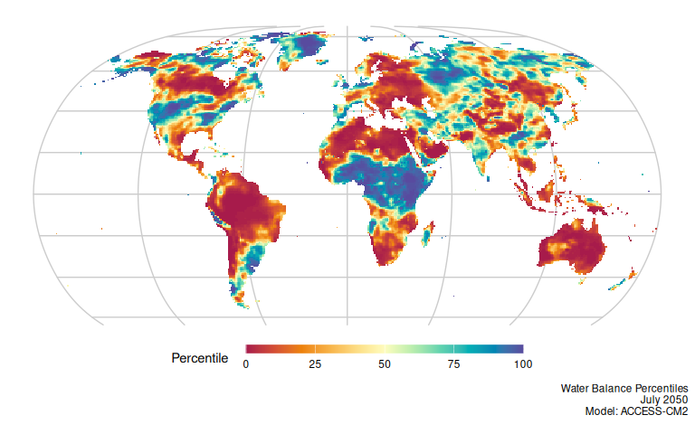

# NEX-GDDP-CMIP6 Drought and Aridity Processing

This directory contains scripts to process NEX-GDDP-CMIP6 climate model
data to calculate water balance anomalies and aridity indices. The
workflow computes potential evapotranspiration (PET) and water balance,
followed by historical baseline fitting to derive standardized
percentiles. Results are at 1/4 degree, monthly resolution.

## Scripts Overview

- `df_nex_files_create.R`: Downloads the index of available
  NEX-GDDP-CMIP6 files from AWS–including model, scenario, variable,
  year, and version–and compiles a CSV catalog (`df_nex_files.csv`)
  containing the latest file versions.
- `tisr_cal_month_create.R`: Downloads Top of Atmosphere (TOA) incident
  solar radiation from ERA5 (1970-2000), calculates the multi-year mean
  for each calendar month, and saves it for use in PET calculations.
- `calculate_wb_ai.R`: Computes the monthly Penman-Monteith PET and
  Water Balance (precipitation minus PET), as well as the annual Aridity
  Index (AI: ratio of precipitation to PET).
- `calculate_wb_anom.R`: Calculates water balance percentiles over
  3-month and 12-month integration (rolling) windows. It fits a
  generalized logistic distribution via L-moments to a baseline period
  (1991-2020), which is then used to derive percentiles for the entire
  time series (1970-2099). The spatial processing uses a tiling approach
  to handle large memory requirements.

## Water Balance Percentile Map

